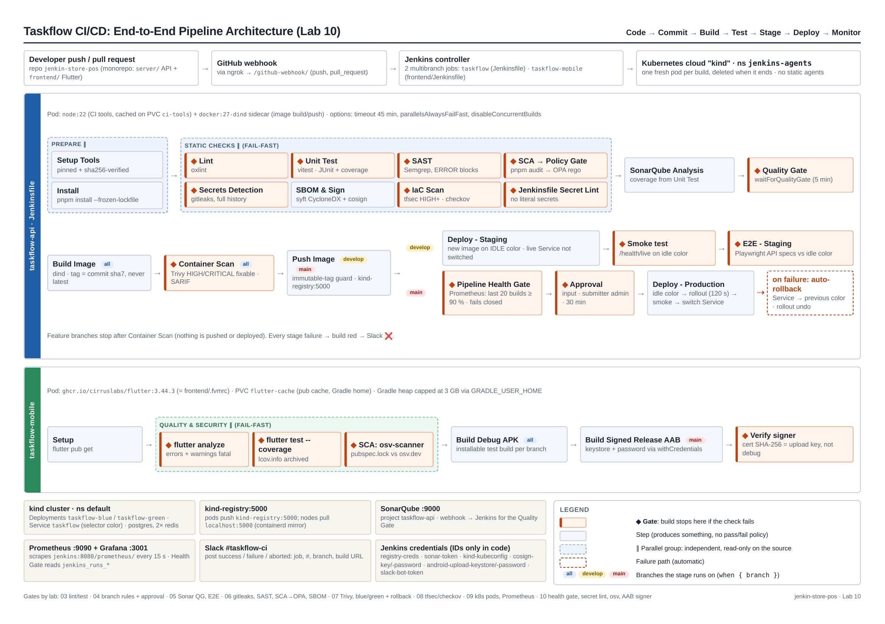

# Jenkins CI/CD Workshop: Lab Deliverables

**Sarankorn Chaisuntranon · 6610110289**

This repository holds the pipeline code and the deliverables for the *Pipeline Lab Manual: Jenkins CI/CD Workshop* (Labs 01–10). The pipelines build, test, secure and deploy **taskflow-api** (the NestJS backend in `server/`) and its Flutter client **taskflow-mobile** (`frontend/`).

## 📄 Lab report (required deliverable)

### ➡️ [**Jenkin-Report-6610110289.pdf**](docs/Jenkin-Report-6610110289.pdf)

It contains every screenshot, log and output the lab manual asks for, Labs 01–10 (16 pages).

> The agent secret on page 1 (`docker run … jenkins/inbound-agent … <AGENT_SECRET> linux-build`) is redacted in this public copy. Secrets never go in git. That's the Lab 06 and Lab 10 rule.

---

## Deliverables by lab

| Lab | Topic | Deliverables in the report | Evidence in this repo |
|---|---|---|---|
| **01** | Installing Jenkins & the first job | Controller + inbound agent commands, `linux-build` online, `taskflow-smoke` green, what happens on a controller restart | p. 1–2 |
| **02** | Plugins, global tools & RBAC | Installed plugins, JDK + NodeJS global tools, role matrix (admin / developer), backup & restore | p. 3–5 |
| **03** | First declarative pipeline | Red build (failing unit test) and green build | [`Jenkinsfile`](Jenkinsfile) · p. 6 |
| **04** | Git, GitHub & multibranch | GitHub webhook delivery `200`, branch strategy (feature → develop → main, approval before production) | p. 7 |
| **05** | Automated testing & quality gates | Test trend, Playwright HTML report, SonarQube quality gate | [`e2e/`](e2e) · [`sonar-project.properties`](sonar-project.properties) · p. 8 |
| **06** | Shift-left security | Gitleaks report, OPA policy | [`policy/security.rego`](policy/security.rego) · [`.gitleaks.toml`](.gitleaks.toml) · p. 9 |
| **07** | Containers, image scanning & blue/green | `svc taskflow` before/after the switch (blue → green), Trivy SARIF, automatic rollback log | [`k8s/`](k8s) · [`server/Dockerfile`](server/Dockerfile) · p. 9–11 |
| **08** | Infrastructure as Code | Checkov output, approval prompt + apply output | [`infra/`](infra) ([`infra/Jenkinsfile`](infra/Jenkinsfile), [`terraform/`](infra/terraform), [`ansible/`](infra/ansible)) · p. 12 |
| **09** | Jenkins on Kubernetes & metrics | Jenkinsfile diff (Docker agent → Kubernetes pod), Grafana dashboard JSON, queue-time alert under load | [`k8s/jenkins-agents.yaml`](k8s/jenkins-agents.yaml) · [`monitoring/`](monitoring) · [`jenkins/`](jenkins) · p. 13–14 |
| **10** | Capstone: end-to-end pipeline | Architecture diagram and rollback runbook | [`docs/lab10/`](docs/lab10) · p. 15–16 |

## Lab 10: architecture

* 📐 [Architecture diagram (PDF, one page)](docs/lab10/architecture.pdf)
* 🧯 [Rollback runbook (PDF)](docs/lab10/rollback-runbook.pdf) · [Markdown source](docs/lab10/rollback-runbook.md)

**Code → Commit → Build → Test → Stage → Deploy → Monitor.** Two pipelines run from one repo, and each build gets a fresh Kubernetes pod:

* **taskflow-api** ([`Jenkinsfile`](Jenkinsfile)): lint, unit test, SAST, SCA → OPA policy gate, gitleaks, SBOM + cosign, IaC scan and Jenkinsfile secret lint run **in parallel** (fail-fast). Then SonarQube Quality Gate → image build → Trivy scan → push. `develop` deploys to staging (the idle blue/green color) + E2E. `main` goes through a Prometheus **pipeline health gate** (last 20 builds ≥ 90 %), a manual approval, then the blue/green switch with automatic rollback.
* **taskflow-mobile** ([`frontend/Jenkinsfile`](frontend/Jenkinsfile)): `flutter analyze`, `flutter test --coverage` and osv-scanner in parallel → debug APK on every branch → signed release AAB on `main`, with the signer fingerprint verified.
* Slack notifications on success and failure (branch name + build URL).

---

## Repository map (Jenkins-related files)

| Path | What it is | Lab |
|---|---|---|
| [`Jenkinsfile`](Jenkinsfile) | taskflow-api pipeline | 03 → 10 |
| [`frontend/Jenkinsfile`](frontend/Jenkinsfile) | taskflow-mobile (Flutter/Android) pipeline | 10 |
| [`ci/`](ci) | Pipeline scripts: pinned + checksum-verified tool installer, health gate, Jenkinsfile secret lint, osv-scanner, AAB signature check | 10 |
| [`policy/security.rego`](policy/security.rego) | OPA policy: deny critical vulnerabilities | 06 |
| [`.gitleaks.toml`](.gitleaks.toml) | Gitleaks config + allowlist for test fixtures | 06 |
| [`e2e/`](e2e) | Playwright API specs | 05 |
| [`k8s/`](k8s) | kind config, registry mirror, app + deps manifests (blue/green), agent namespace/RBAC, CI cache PVCs | 07, 09, 10 |
| [`infra/`](infra) | Terraform (LocalStack) + Ansible, IaC pipeline and bootstrap pipeline | 08 |
| [`monitoring/`](monitoring) | Prometheus config, SLO + alert rules, Grafana dashboard, `SLO.md` | 09 |
| [`jenkins/`](jenkins) | Helper jobs: k8s smoke test, load/saturation test (09), health-gate demo (10) | 09, 10 |
| [`docs/lab10/`](docs/lab10) | Architecture diagram, rollback runbook, secret inventory, demo script | 10 |
| [`docs/Jenkin-Report-6610110289.pdf`](docs/Jenkin-Report-6610110289.pdf) | **The lab report** | 01–10 |

## Jenkins setup at a glance

| Item | Value |
|---|---|
| Controller | `jenkins/jenkins:lts-jdk21` in Docker, network `jenkins-net`, ports 8080 / 50000 |
| Agents | Lab 01–08: static inbound agent `linux-build`. Lab 09+: ephemeral pods from the Kubernetes cloud `kind`, namespace `jenkins-agents` |
| Jobs | `taskflow-smoke` (01) · `taskflow-pipeline` (03) · multibranch `taskflow` (04+) · `taskflow-infra`, `lab08-bootstrap` (08) · `lab09-*` (09) · multibranch `taskflow-mobile`, `lab10-sim*` (10) |
| Supporting services | SonarQube :9000 · kind cluster + `kind-registry:5000` · LocalStack (08) · Prometheus :9090 + Grafana :3001 |
| Credentials | Only **IDs** appear in code: `sonar-token`, `cosign-key`, `cosign-password`, `kind-kubeconfig`, `k8s-jenkins-sa-token`, `lab08-ssh-key`, `localstack-auth-token`, `registry-creds`, `android-upload-keystore`, `android-keystore-password`, `slack-bot-token` |
